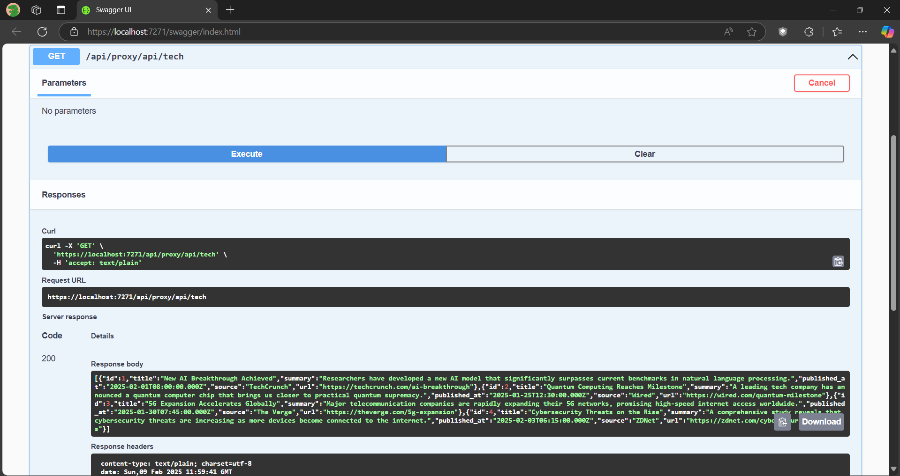

# ApiGateway

This project is a .NET Core Web API application that serves as an API Gateway. It includes a Swagger UI for endpoint testing and is designed for practicing API development in C#.

## Features

- **API Gateway**: Central point for managing and routing API requests.
- **Swagger UI**: Integrated Swagger UI for easy testing and documentation of endpoints.
- **Containerized Node App**: The application will interact with a containerized Node.js application.
- **MySQL Database**: Data will be queried from a containerized MySQL database.

## Getting Started

### Prerequisites

- [.NET Core SDK](https://dotnet.microsoft.com/download)
- [Podman](https://podman.io/getting-started)

### Running the Application

1. Clone the repository:
    ```sh
    git clone https://github.com/RelCode/practice.git
    cd practice/csharp/ApiGateway
    ```

2. Build and run the Podman containers for the Node.js app and MySQL database:
    ```sh
    cd ../../node/node_podman
    podman-compose up --build
    ```

3. Open your browser and navigate to `http://localhost:5000/swagger` to access the Swagger UI.

4. Open the .NET Core project in Visual Studio and run the application.

## Project Structure

- **/Controllers**: Contains the API controllers.
- **/Models**: Contains the data models.
- **/Services**: Contains the service layer for business logic.
- **/Podman**: Container was used for containerization of Node.js app and MySQL database.

## Screenshot

Below is a screenshot of the Swagger UI displaying the result after a successful API call to the Node.js server that queries data from a containerized MySQL database.

