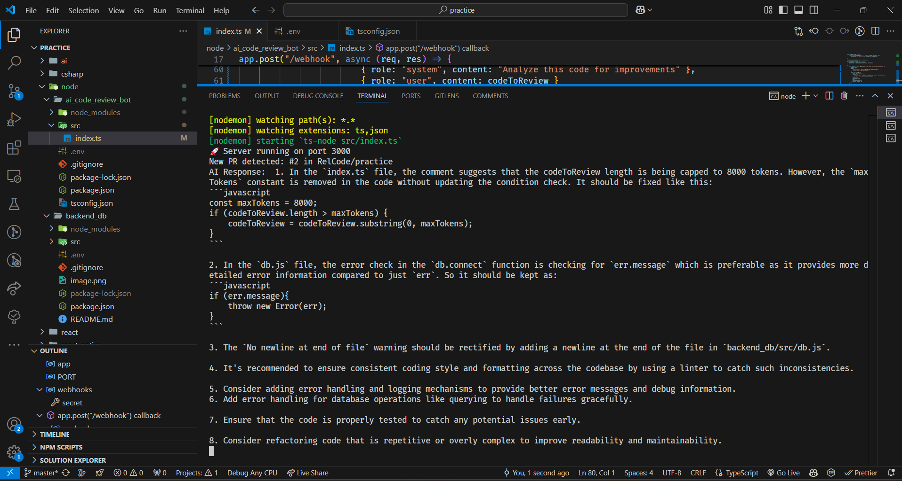

/**
 * Bot Code Reviewer
 *
 * This Node.js project is a bot that reviews code in pull requests on GitHub. It is connected to GitHub via webhooks and uses the OpenAI API to analyze the code. The bot looks for any pull requests, reviews the code, and suggests improvements.
 *
 * ## Features
 * - Connects to GitHub via webhooks to monitor pull requests.
 * - Uses OpenAI API to analyze and review code.
 * - Provides suggestions for code improvements.
 *
 * ## Screenshot
 * 
 *
 * ## Setup
 * 1. Clone the repository.
 * 2. Install dependencies using `npm install`.
 * 3. Configure GitHub webhooks and OpenAI API keys.
 * 4. Run the bot using `npm start`.
 *
 * ## Usage
 * - The bot will automatically review any new pull requests and provide feedback.
 *
 * ## Contributing
 * - Contributions are welcome! Please submit a pull request or open an issue for any suggestions or improvements.
 *
 * ## License
 * - This project is licensed under the MIT License.
 */