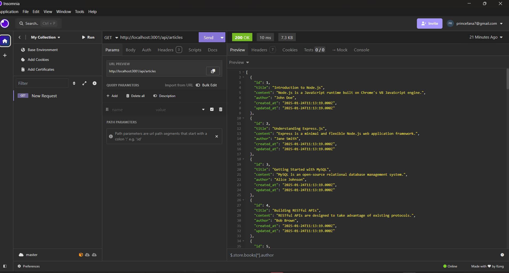

# Node Server with MySQL2 Integration

This project is a Node.js server that acts as an API endpoint. It includes the `mysql2` package for database integration, allowing for data persistence. The server features a self-updating database system, where tables have a version number suffix. On each server start, a script checks for new table versions and updates the database accordingly.

## Features

- Node.js server
- API endpoint
- MySQL2 integration
- Self-updating database tables

## Installation

1. Clone the repository:
    ```sh
    git clone https://github.com/RelCode/practice.git
    ```
2. Navigate to the project directory:
    ```sh
    cd node > backend_db
    ```
3. Install dependencies:
    ```sh
    npm install
    ```

## Usage

1. Start the server:
    ```sh
    npm start
    ```
2. The server will automatically check for database updates and apply them if necessary.

## Database Configuration

Ensure you have a MySQL database set up and update the configuration in `config.js` with your database credentials.
"""
Updates the database schema by executing SQL scripts located in the database folder.

The database folder consists of subfolders named after the table names. Each subfolder contains SQL scripts 
that define the schema for the respective table. The scripts follow a versioning convention, starting with 
`v1.sql` for the initial schema definition. For example, the `users` table will have a `v1.sql` script that 
creates the `users` table.

When adding a new table, such as `userContacts`, the SQL statements should be added to the `v1.sql` script inside the `users` folder. Ensure that the SQL statements include the `IF NOT EXISTS` condition 
to prevent errors if the table already exists from a previous version.

After making updates to the SQL scripts, the person responsible must rename the script file to the next 
version number (e.g., from `v1.sql` to `v2.sql`). Each time database changes are made in any folder, the 
script file name must be incremented by `v(n+1).sql`.

Note: The database updater will execute these scripts and in the database the latest version installed for each category will be inserted.
IMPORTANT: naming a sql file with a lesser version number will render the statement useless
"""


## NOTE

This project is currently NOT connected to any client-facing project. It can be used as a backend for another project or as an API endpoint for multiple projects that will be querying it for database interactions.


## Example API Request

Below is a screenshot of a GET request to `https://localhost:3001/api/articles`, demonstrating the backend being used as an API endpoint:

