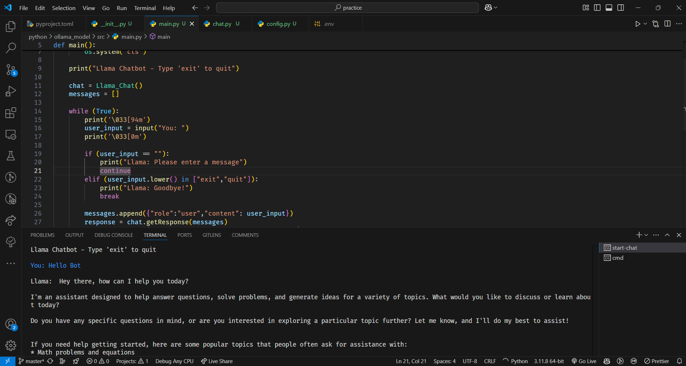

# Python Console-Based Application with Llama3.2 Model

This project is a Python-based console application that allows users to interface with the Llama3.2 model. The application provides a simple and intuitive way to interact with the model directly from the command line.

## Features

- Interface with the Llama3.2 model
- Console-based user interface
- Easy to use and extend

## Installation

1. Clone the repository:
    ```bash
    git clone https://github.com/RelCode/practice.git
    ```
2. Navigate to the project directory:
    ```bash
    cd practice > python > ollama_model
    ```
3. Install the required dependencies:
    ```bash
    pip install -r requirements.txt
    ```

## Usage

To start the application, run the following command:
```bash
start-chat
```

## Screenshot



## Contributing

Contributions are welcome! Please open an issue or submit a pull request for any changes.

## Contact

For any questions or inquiries, please contact [princefana@gmail.com](mailto:princefana7@gmail.com).
