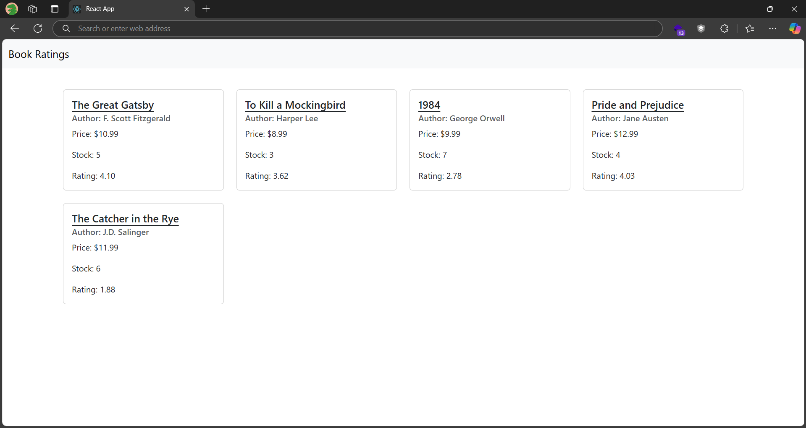

# Book Ratings App

This project is a React application that allows users to rate books. It was inspired by a previous books app created using a .NET Core Web API.

## Features

- Fetches book data from an SQLite database.
- Displays book information along with a rating system.
- Allows users to rate books.
- The database includes ratings and rater columns in the books table.

## Technologies Used

- React
- .NET Core Web API
- SQLite

## Setup

1. Clone the repository:
    ```bash
    git clone https://github.com/RelCode/practice.git
    ```
2. Navigate to the project directory:
    ```bash
    cd react > book_ratings
    ```
3. Install dependencies:
    ```bash
    npm install
    ```
4. Start the React application:
    ```bash
    npm start
    ```

## API

The application queries book data via a .NET Core Web API. Ensure the API is running and accessible for the React app to fetch data.

## Database

The SQLite database has been modified to include the following columns in the books table:
- `ratings`: Stores the rating of the book.
- `rater`: Stores the user who rated the book.

## Usage

- Open the application in your browser.
- Browse through the list of books.
- Rate books and see the average rating.


## Screenshot

Here is a screenshot of the Book Ratings App showing books that have been rated:

